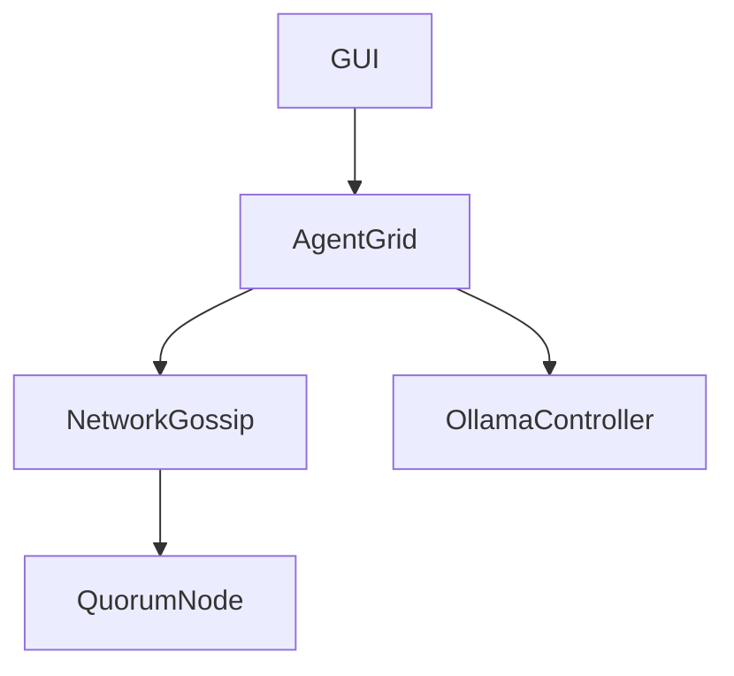

# System Blueprint

## ASCII Data Flow Diagrams

```
[Ollama Nodes] <---> (Gossip Protocol) <---> [Agent Grid]
                                                  |
                                                  v
                                         [Hexeract State Space]
                                                  |
                                                  v
[JavaFX UI / GodHand] <------------------- [Quorum Consensus]
```

## System Architecture
A distributed simulation mesh leveraging local SLM nodes (via Ollama). The architecture relies heavily on peer-to-peer data distribution (Gossip Protocol) and fault-tolerant agreement (Quorum Consensus).

## Module Dependency Graph


## Hexeract State Space Mapping
The vertices of the 6-dimensional hypercube represent discrete agent states. Transitions between vertices are constrained by valid hyper-edges.

## Quorum Consensus Protocol
Agents require a 51% majority quorum to validate and transition global state vectors.

## Gossip Propagation Paths
Information traverses the grid via pseudo-random walks weighted by node latency, simulating viscoelastic fluid dynamics.

## Viscoelastic Heartbeat Dynamics
Heartbeats exhibit viscoelastic properties: under high load, the heartbeat frequency becomes rigid and synchronized; under low load, it becomes elastic and asynchronous, saving resources.
