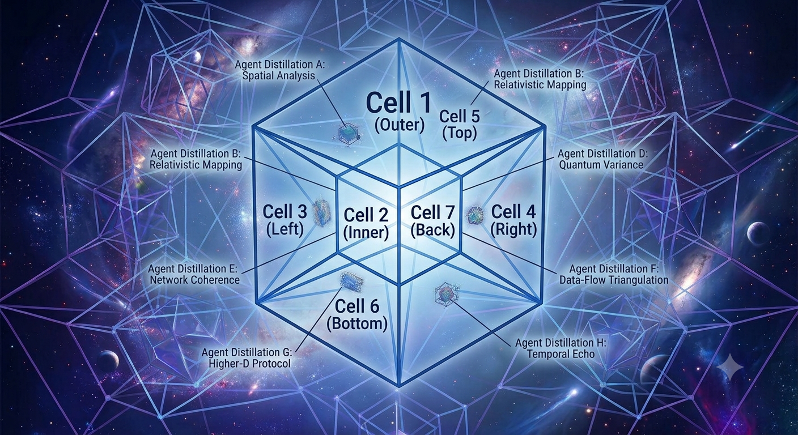
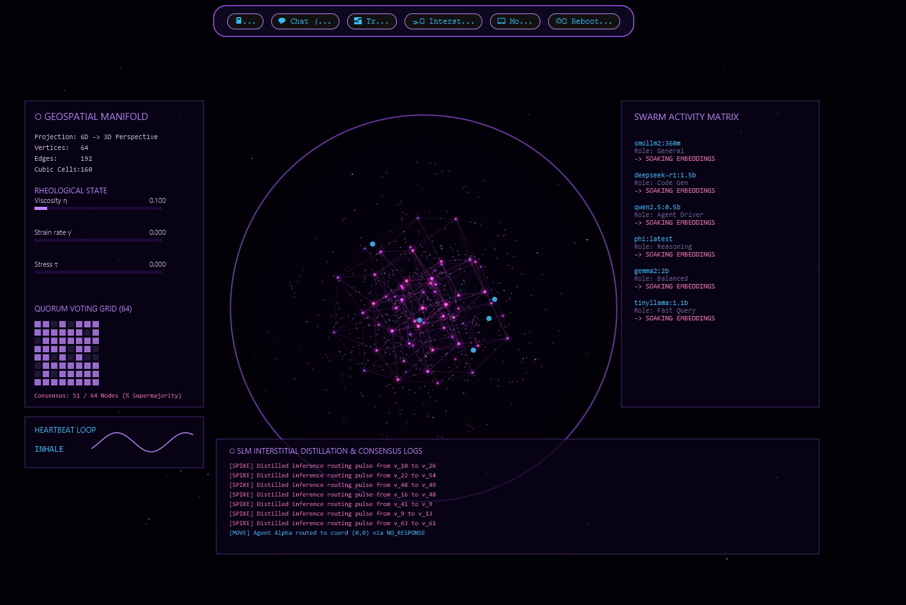
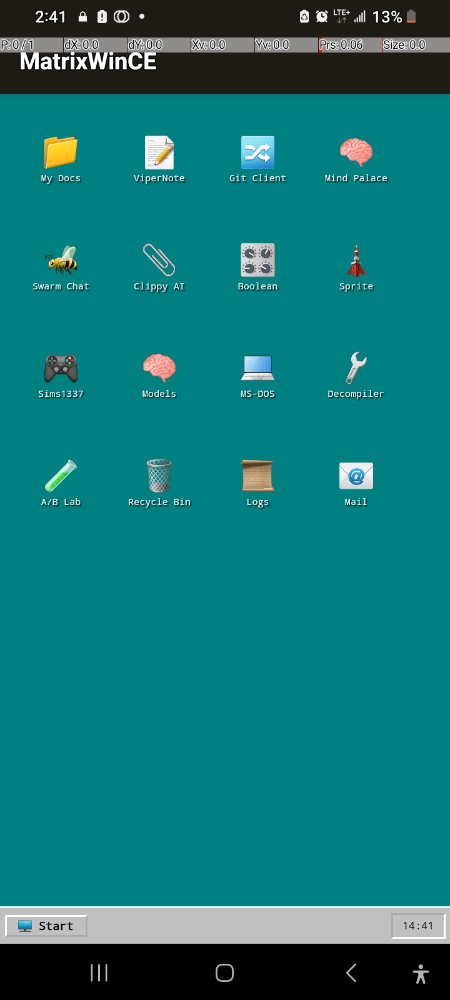
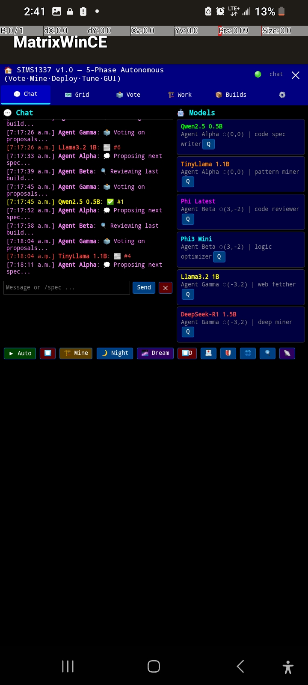

# ⬡ SIMS1337 — Breathing Hexeract Local Agent Grid





## 📸 Live Screens

**Real GUI (GodHand on device)**



**Swarm Hub — Executive Cortex**



---


```
   ╔═══════════════════════════════════════════════════════════════════╗
   ║   _____ _____ __  __ _____ __ __________ _____                  ║
   ║  / ___//  _/ |  \/  / ___// /|__  /__  //__  /                  ║
   ║  \__ \ / /   | |\/| \__ \/ /   / /  / /   / /                   ║
   ║ ___/ // /    | |  | |__/ / /   / /  / /   / /                   ║
   ║/____/___/    |_|  |_/____/_/  /_/  /_/   /_/                    ║
   ║                                                                  ║
   ║  HEXERACT LOCAL AGENT GRID — 6D HYPERCUBE STATE ENGINE          ║
   ╚═══════════════════════════════════════════════════════════════════╝
```

> **Never delete, only add and merge. Nothing lives forever, nothing runs for free.**
> **Always advancing, always progressing.**

---

## ⬡ What is SIMS1337?

A **decentralized local desktop AI agent grid** running Small Language Models (SLMs) through Ollama,
orchestrated across a **6-Dimensional Hypercube (Hexeract) state space topology** with:

- **Viscoelastic heartbeat dynamics** — the system *breathes* using non-Newtonian fluid mechanics
- **Quorum consensus** — ⅔ supermajority (43/64 vertices) using topological homology
- **Gossip propagation** — anti-entropy state exchange across 192 edges
- **Carreau-Yasuda shear thinning** — auto-scaling under load (η drops when strain rate ↑)
- **Byzantine fault tolerance** — survives up to 21 unresponsive nodes

---

## ⬡ ASCII Topological File Tree

```
local_desktop_main/                         ← Project Root (Git)
│
├── pom.xml                                 ← Maven Build (Java 17, JavaFX)
├── README.md                               ← This file
├── BLUEPRINT.md                            ← Architecture & Data Flow
├── CHANGELOG.md                            ← Version history
│
├── src/
│   ├── main/
│   │   ├── java/com/aigen/sims/
│   │   │   ├── GodHandApp.java             ← JavaFX Main GUI (GodHand Dashboard)
│   │   │   ├── HeadlessPipeline.java        ← Headless agent pipeline runner
│   │   │   ├── AutoLoop.java               ← Autonomous loop controller
│   │   │   ├── agent/
│   │   │   │   ├── OllamaClient.java        ← Ollama HTTP API client
│   │   │   │   ├── AgentNode.java           ← SLM agent instance
│   │   │   │   ├── AgentGrid.java           ← 64-vertex hexeract grid
│   │   │   │   └── Heartbeat.java           ← Viscoelastic breath cycle
│   │   │   ├── bridge/
│   │   │   │   └── BruteMiner.java          ← Code-mining brute force engine
│   │   │   ├── deploy/
│   │   │   │   ├── DeployOrchestrator.java  ← Deploy cycle orchestrator
│   │   │   │   ├── GateKeeper.java          ← Multi-level gate approval
│   │   │   │   └── GitBackupManager.java    ← Git snapshot & backup
│   │   │   ├── gui/
│   │   │   │   ├── AegisSwingSphere.java    ← 3D Rotating Sphere GUI (Swing)
│   │   │   │   ├── GuiGardener.java         ← Self-modifying GUI proposals
│   │   │   │   └── ComponentProposal.java   ← UI component evolution
│   │   │   ├── lora/
│   │   │   │   ├── LoRAAdapter.java         ← LoRA adapter definitions
│   │   │   │   ├── LoRATuner.java           ← Performance-based LoRA tuning
│   │   │   │   └── AdapterRegistry.java     ← Adapter election & voting
│   │   │   ├── mining/
│   │   │   │   ├── CodeMiner.java           ← Repository code mining
│   │   │   │   ├── CodeMinerOrchestrator.java ← Mining pipeline controller
│   │   │   │   ├── Suggestion.java          ← Code improvement suggestions
│   │   │   │   └── SuggestionRegistry.java  ← Suggestion tracking & status
│   │   │   ├── phase1/
│   │   │   │   ├── HexCoord.java            ← Hex grid coordinate system
│   │   │   │   ├── FOWGate.java             ← Fog-of-War attention gate
│   │   │   │   └── QuorumVoting.java        ← Phase 1 quorum consensus
│   │   │   ├── routing/
│   │   │   │   ├── ModelRouter.java         ← SLM model router (complexity-based)
│   │   │   │   ├── ModelPool.java           ← Model pool manager
│   │   │   │   ├── LoRASwitcher.java        ← Dynamic LoRA adapter switching
│   │   │   │   └── TaskQueue.java           ← Prioritized task queue
│   │   │   ├── scheduler/
│   │   │   │   ├── PipelineScheduler.java   ← Pipeline scheduling engine
│   │   │   │   └── EventBus.java            ← Internal event messaging
│   │   │   ├── tasks/
│   │   │   │   ├── Task.java                ← Task definitions
│   │   │   │   ├── Complexity.java          ← Task complexity classification
│   │   │   │   └── TaskStatus.java          ← Task status enum
│   │   │   ├── voting/
│   │   │   │   ├── WeightedQuorumVote.java  ← Weighted quorum consensus
│   │   │   │   └── HexCoord.java            ← Hex coordinate for voting
│   │   │   └── web/
│   │   │       └── WebDashboard.java        ← Embedded web server (Javalin)
│   │   └── resources/fxml/
│   │       ├── GodHand.fxml                 ← GodHand dashboard layout
│   │       ├── PlayerGrid.fxml              ← 2D player grid view
│   │       ├── PlayerGrid3D.fxml            ← 3D player grid view
│   │       ├── RealPlayerGrid.fxml          ← Live player grid
│   │       ├── TabbedGodHand.fxml           ← Tabbed GodHand layout
│   │       └── UnifiedBackend.fxml          ← Backend management view
│   └── test/java/com/aigen/sims/
│       ├── bridge/BruteMinerTest.java
│       ├── deploy/DeployTest.java
│       ├── gui/GuiGardenerTest.java
│       ├── lora/LoRATest.java
│       ├── mining/CodeMinerTest.java
│       ├── phase1/TestQuorumVoting.java
│       ├── routing/
│       │   ├── LoRASwitcherTest.java
│       │   ├── ModelPoolTest.java
│       │   ├── ModelRouterTest.java
│       │   └── TaskQueueTest.java
│       └── voting/WeightedQuorumVoteTest.java
│
├── web/                                     ← Web Frontend & Server
│   ├── server.js                            ← Express.js backend (port 8080)
│   ├── package.json                         ← Node.js dependencies
│   ├── index.html                           ← RISC Manifold 3D web GUI
│   └── hexeract-gui/
│       └── index.html                       ← ⬡ BREATHING HEXERACT GUI ⬡
│
├── scripts/                                 ← Utility scripts
│   ├── agents/                              ← Agent messenger & crew loop
│   ├── toc_tok/                             ← TOC/TOK editor
│   ├── build_llamacpp.py                    ← llama.cpp build helper
│   ├── chat_server.py                       ← Python chat server
│   ├── download_gguf.py                     ← GGUF model downloader
│   ├── lstm_refractor.py                    ← LSTM refactoring utility
│   └── train_lora.py                        ← LoRA training script
│
├── lora/                                    ← LoRA / Hessian learning
│   ├── hessian_learning.py                  ← Hessian-based LoRA learning
│   └── test_hessian_learning.py             ← Hessian tests
│
├── code_registry/                           ← NEVER-MAKE-CODE-TWICE DB
│   ├── code_registry.db                     ← SQLite database (110 pages)
│   └── scan_and_register.py                 ← Scanner/registrar script
│
├── build/                                   ← Compiled Java classes
├── target/                                  ← Maven build output
└── suggestions/                             ← Code improvement proposals
```

---

## ⬡ Hexeract State Space — 6 Dimensions

```
  ┌──────────────────────────────────────────────────────────────┐
  │  AXIS   │  METRIC              │  DESCRIPTION               │
  ├─────────┼──────────────────────┼────────────────────────────┤
  │  x₁     │  Entity Class        │  MODEL, SERVER, PID, REPO  │
  │  x₂     │  Temporal (t)        │  Past ← NOW → Future       │
  │  x₃     │  Comp. Load (η)      │  CPU/thread viscosity       │
  │  x₄     │  Code Delta (ΔC)     │  Repo state drift           │
  │  x₅     │  Consensus (Wᵥ)      │  Quorum rank & reputation   │
  │  x₆     │  Topology Shard      │  Network routing cluster    │
  └──────────────────────────────────────────────────────────────┘

  Combinatorics:
    Vertices     N₀ = 2⁶       = 64
    Edges        N₁ = 2⁵·C(6,1) = 192
    Square Faces N₂ = 2⁴·C(6,2) = 240
    Cubic Cells  N₃ = 2³·C(6,3) = 160
    Tesseracts   N₄ = 2²·C(6,4) = 60
    5-Cube Facets N₅ = 2¹·C(6,5) = 12
```

---

## ⬡ Viscoelastic Heartbeat (Breathing)

```
  ψ(x,t) = A · sin(ωt - k·x) · e^(-η/ρ · t)

  ┌─────────────────────────────────────────────────────┐
  │  INHALE (∂ψ/∂t > 0)                                │
  │  ► Expansion & gossip dispersal                     │
  │  ► Viscosity drops to η_min                         │
  │  ► 192 edges dilate for state streaming             │
  │  ► PIDs broadcast across peripheral k-faces         │
  ├─────────────────────────────────────────────────────┤
  │  EXHALE (∂ψ/∂t < 0)                                │
  │  ► Compression & quorum settlement                  │
  │  ► Dynamic pressure rises to τ_yield                │
  │  ► Consensus weights calculated                     │
  │  ► Code state solidified & committed                │
  └─────────────────────────────────────────────────────┘

  Carreau-Yasuda Shear Thinning:
    η(γ̇) = η∞ + (η₀ - η∞) · (1 + (λγ̇)²)^((n-1)/2)
    n < 1 → viscosity DROPS under high-throughput gossip surges
```

---

## ⬡ Quorum Consensus (Topological Homology)

```
  Threshold: |Q| ≥ ⌈(2·64 + 1)/3⌉ = 43 vertices

  Byzantine Fault Tolerance: f < 22 unresponsive nodes
  
  Betti Number β₁ = 0 → Every closed gossip cycle is the
  boundary of a higher-dimensional face. No partition deadlock.
  
  Commit Rule: ‖q‖₁ ≥ 43 AND δ⁰q* = 0 on active sub-complex Q
```

---

## ⬡ Running the System

### Breathing Hexeract Web GUI
```bash
cd web && npm install && node server.js
# Open http://localhost:8080
```

### Java Desktop GUI (AegisSwingSphere)
```bash
# Compile
javac -d build src/main/java/com/aigen/sims/gui/AegisSwingSphere.java

# Launch
java -cp build com.aigen.sims.gui.AegisSwingSphere
```

### Java GodHand Dashboard (Maven/JavaFX)
```bash
mvn compile
mvn javafx:run
```

### Ollama Models (37 loaded)
```
qwen2.5:3b          qwen2.5-coder:3b    phi3:mini
gemma2:2b            codellama:7b        deepseek-r1:1.5b
llama3.2:1b          tinyllama:1.1b      smollm2:360m
qwen2.5:0.5b         qwen3:4b            qwen3:latest
+ 25 more including abliterated variants, vision models, custom Modelfiles
```

---

## ⬡ Tech Stack

| Layer | Technology |
|---|---|
| Desktop GUI | Java 21, Swing, JavaFX 17 |
| Web GUI | HTML5 Canvas, Three.js, CSS glassmorphism |
| Web Server | Node.js v24.14.1, Express.js |
| SLM Runtime | Ollama (37 models, mmap to SSD) |
| Build | Maven 3.9.16 |
| Database | SQLite (code_registry.db — 110 pages) |
| Consensus | Hexeract quorum (⅔ threshold) |
| Version Control | Git, GitHub (chrisalunlloyd2-sudo) |

---

## ⬡ License & Philosophy

> Nothing lives forever, nothing runs for free.
> Always advancing, always progressing.
> Never delete, only add and merge.
## White Paper

Full technical white paper: [SIMS1337_White_Paper.md](SIMS1337_White_Paper.md)
